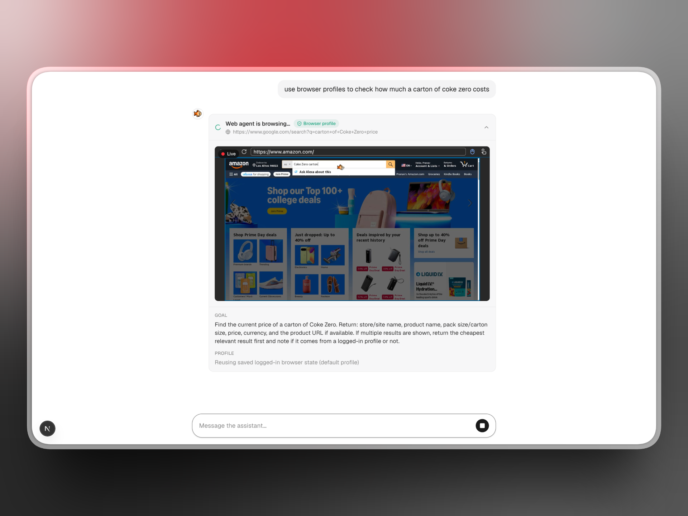

# AI Chat · TinyFish Web Agent

A clean, minimal **ChatGPT-style** chat app built with the **Vercel AI SDK** and
**OpenRouter**, with smooth token streaming and a tool that dispatches the
**[TinyFish](https://tinyfish.ai) web agent**.

The TinyFish tool is here to showcase **Browser Context Profiles** — persistent,
logged-in browser state that the agent reuses across runs, so it can act on
sites behind a login without signing in every time.

 



> Watching the TinyFish agent browse Amazon live, signed in via a saved browser
> profile, to look up a price — embedded right in the chat.

## Features

- 💬 **ChatGPT-like UI** — minimal, responsive, light/dark, markdown + code blocks
- 🌊 **Smooth streaming** — token-by-token responses via the Vercel AI SDK
- 🔀 **OpenRouter** — swap between hundreds of models with one env var
- 🤖 **TinyFish web agent tool** — the model can browse and act on live websites
- 📺 **Live browser view** — watch the agent work in real time in an embedded iframe
- 🔐 **Browser profiles** — runs reuse saved logged-in state (`use_profile`)
- 🧱 **Clean, commented code** — built to be read, forked, and extended

## Stack

| Layer     | Choice                                       |
| --------- | -------------------------------------------- |
| Framework | Next.js (App Router) + React                 |
| Styling   | Tailwind CSS v4                              |
| AI        | Vercel AI SDK v6 (`ai`, `@ai-sdk/react`)     |
| Model     | OpenRouter (`@openrouter/ai-sdk-provider`)   |
| Web agent | TinyFish Agent API (`/v1/automation/run`)    |

## Getting started

### 1. Install

```bash
npm install
```

### 2. Add your keys

Copy the example env file and fill in your keys:

```bash
cp .env.example .env.local
```

```env
OPENROUTER_API_KEY=...   # https://openrouter.ai/keys
TINYFISH_API_KEY=...     # https://agent.tinyfish.ai/api-keys
# Optional — any tool-calling model slug:
OPENROUTER_MODEL=anthropic/claude-3.5-sonnet
```

### 3. Run

```bash
npm run dev
```

Open [http://localhost:3000](http://localhost:3000).

## How it works

```
┌───────────────┐   POST /api/chat    ┌──────────────────────┐
│  components/   │ ──────────────────► │  app/api/chat         │
│  chat.tsx      │   (useChat hook)    │  route.ts             │
│  (UI + stream) │ ◄────────────────── │  streamText + tool    │
└───────────────┘  UI message stream   └──────────┬────────────┘
                                                   │ browseWeb tool
                                                   ▼
                                        ┌──────────────────────┐
                                        │  lib/tinyfish.ts      │
                                        │  TinyFish Agent API   │
                                        │  use_profile: true    │
                                        └──────────────────────┘
```

- **`app/api/chat/route.ts`** — streams the model response and defines the
  `browseWeb` tool. `streamText` + `stopWhen: stepCountIs(5)` lets the model
  call the tool and then write a final answer in the same turn.
- **`lib/tinyfish.ts`** — a tiny client for the TinyFish Agent API. It starts an
  async run, then polls it, yielding each phase (`starting → running → done`) as
  an async generator. It passes `use_profile: true` so runs reuse saved browser
  state, and surfaces the run's `streaming_url` for the live view. This is the
  file to read to understand both the browser-profiles and live-view features.
- **Live browser view** — because the tool's `execute` is an async generator,
  the AI SDK streams each yield to the UI as a *preliminary* tool result. That
  lets the card embed the run's `streaming_url` in an iframe and show the browser
  live while the agent works, before the final result is even ready.
- **`lib/openrouter.ts`** — the OpenRouter provider and the model slug.
- **`components/chat.tsx`** — the `useChat` client component: messages,
  streaming status, suggestions, and the composer.
- **`components/tool-invocation.tsx`** — the card that renders a web-agent run,
  including the **Browser profile** badge and the returned data.

## Using browser profiles

To make the agent act on a site behind a login, set up a Browser Context Profile
once (TinyFish stores the logged-in cookies/storage), then every `browseWeb`
call with `useProfile: true` reuses it.

1. Create a profile and sign in following the
   [Browser Context Profiles guide](https://docs.tinyfish.ai/agent-api/browser-context-profiles).
2. Make it your default, or note its `profile_id`.
3. Ask the chat to "use my saved browser profile" — the tool runs with
   `use_profile: true` (and an optional `profileId`).

## Swapping the model

Set `OPENROUTER_MODEL` to any [OpenRouter model](https://openrouter.ai/models)
that supports tool calling — e.g. `openai/gpt-4o`, `google/gemini-2.5-pro`,
`anthropic/claude-3.5-sonnet`. No code changes needed.

## Deploy

Deploys to [Vercel](https://vercel.com) with zero config. Add
`OPENROUTER_API_KEY` and `TINYFISH_API_KEY` (and optionally `OPENROUTER_MODEL`)
as environment variables in your project settings.

## License

MIT — use it as a starting point for whatever you're building.
